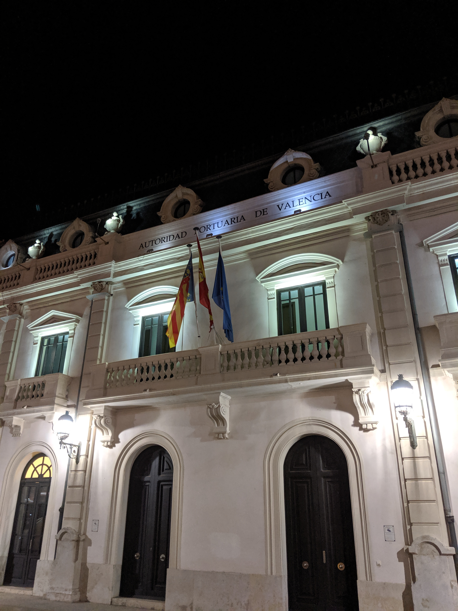
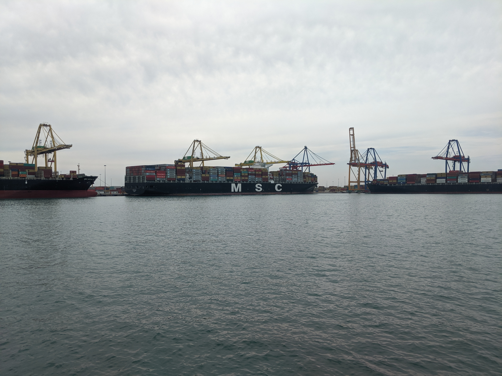
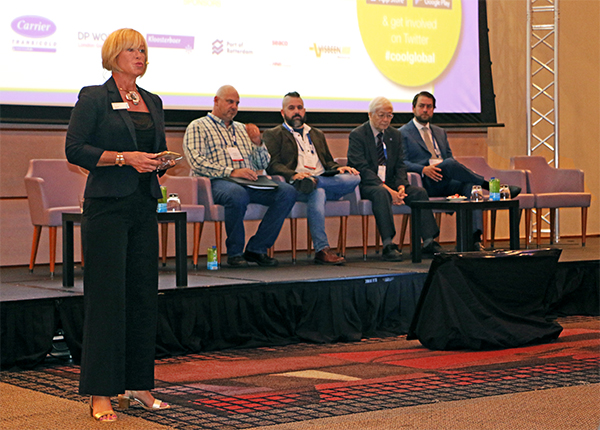
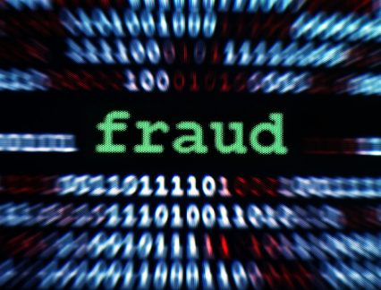
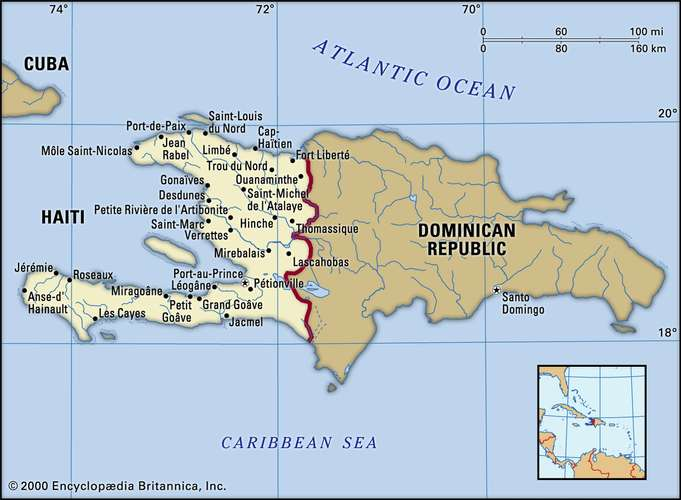

What a fantastic event to teach and learn important leasons about blockchain in the real world
  

<!-- end -->

DataHarvest was invited to speak at Cool Logistics Global Conference.  Many of the companies focused on all things on the water.  Terminals, Shipping lines, Containers, etc.  We met some really nice people that were not sure what to think of blockchain in general yet, but had very open minds and thoughtful comments.  

The Port Authority acted as the hosts and they did a fantastic job featuring the facilities and culture of Valencia 

I learned that as an industry, shipping is changing rapidly in the area around data.  There has always been some early adoption but the damn really broke open in the last couple years.  

More importantly, I met with many businesses that work on all the links in the chain that ultimately bring products to you.  Many of them are really looking for a way to show how they provide value.  How what they do and how they do it improves or even makes possible at all the conspiracy that made that product appear in front of you.  A great take away for me is that they are all looking for ways to tell their story.  I think we got something for them.  

We came to talk about the disruptive future of open ledgers. While a handful of attendees had started to form a blockchain point of view, most had not yet started. We think it is very important to counter the narrative of closed or enterprise blockchains. We were pretty fortunate to have another blockchain project at the conference as well.  Which is a solid bridge to talk about frauds in the blockchain space. 

Another project at the conference was called Agriledger.  Cool name, their face for the project was from central casting, Genevieve.  They had a buzzwordy slide deck and website.  "Guaranteeing authenticity and quality" and even a cute replacement of blockchain with value chain from time to time.  They have a very sympathetic proof of concept, Haiti, and the growers in Haiti.  That about the time we went from sounding interesting to outright insulting and damaging.  So the theory is that growers in Haiti will somehow certify that what they grow is from Haiti.  Problem solved, thank you blockchain, what is next to solve. 

Unfortunately, Genevieve is a complete fraud.  She told the story about how currently Haiti has an unreliable access to export markets.  Growers in Haiti largely smuggle their goods across the border and export through the Dominican Republic.  

I asked how they would use blockchain to "guaranteeing authenticity and quality" with a reality where the access to markets require a fraud.  I thought maybe we would move to conversations about building new paths to market based on provable authenticity, nope.  She said something like, ".... it is early and there will be lots of blockchains for different reasons and applications."  I tried to work through how if her program was implemented it would become a tool to starve out the Haitian grower today.  None of it landed with her at all.  She has no idea what she is talking about.  She looks like the person that would help Haiti out but in fact would choke their last path to market.  Best intention blah blah blah, except...  I told her what the problem was with her project and I am sure others have too and she was impervious to the feedback.

If anyone from that project wants to correct me or debate this I am available, until that time I consider your project and team frauds.