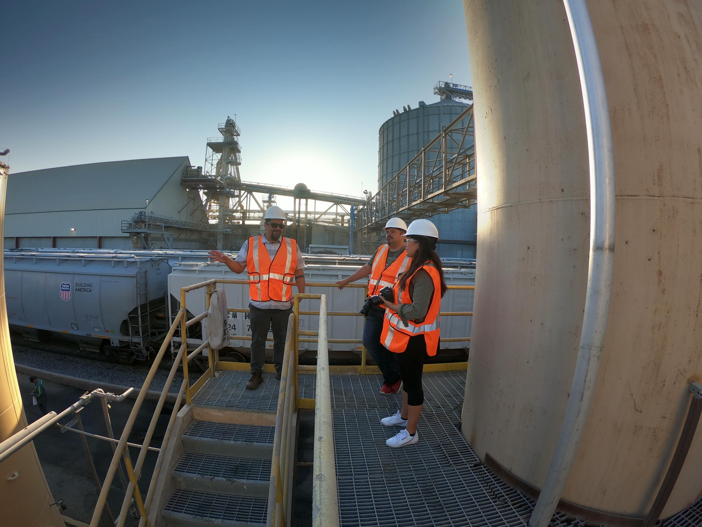

Lots of ways to do a photo shoot, but it has never been easier.
  

<!-- end -->

Sometimes we get a chance to go on site early and shoot photos and video.  You can do this so many ways.  I know some people send huge teams with pallets of gear and huge invoices. With the improvments in hardware and software amazing results can be had at a fraction of the cost.  With so many socail media platforms to fill with new images, this approach is hard to beat.  Here is all you need:

1. GoPro 3+ and up 
2. 1 nice prosumer still camera
3. Prosumer DJI drone

These can all be purchased new for less than $2,500 with all the kit.  Memory, extra chargers, etc. 

Everyone is able to show up, take loads of photos and wrap up in a few hours.  Spend all those hours of setting up light boards or staging the perfect shot on time in post production.  